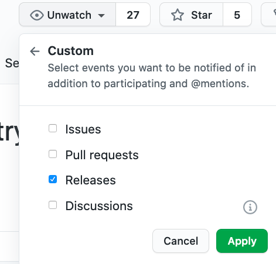

# Beacon Android SDK Samples

This repository contains two sample apps that showcase how to integrate the Beacon Android SDK.

* [Sample Kotlin](./sample-kotlin) - A simple and concise demo that shows how to install, initialise, and two different ways to open your Help Scout Beacon.
* [Sample Customisation](./sample-customisation) - Java based sample illustrates some of the key features you can use to customise the Beacon SDK to add additional data about the user and how to override certain Beacon settings.

## Beacon SDK version [](https://maven-badges.herokuapp.com/maven-central/com.helpscout/beacon)

[Release notes and changelog](https://github.com/helpscout/beacon-android-sdk-sample/blob/master/CHANGELOG.md)

You can subscribe to receive release updates by following these steps:
1. At the top right-hand corner, click on "Watch"
2. Choose "Custom"
3. Check the "Releases" option

[](./docs/subscribe-to-releases.png)


## Documentation

* [Beacon Mobile SDK documentation](https://developer.helpscout.com/beacon-2/mobile/)
* [Android SDK API](https://developer.helpscout.com/beacon-2/android/)
* [Android SDK API reference](https://developer.helpscout.com/beacon-2/android-api/beacon/index.html)

## Requirements

* The minimum supported Android version is 5.0 (SDK INT 21)
* Your app must be compiled with at least an API version **29**
* A Beacon Id created on [Help Scout](https://secure.helpscout.net/settings/beacons/)

## Installation
The Beacon Android SDK is distributed as AAR and available from Maven Central, so add the following lines to your app's `build.gradle` file.

**Groovy**
```groovy
repositories {
    mavenCentral()
    …
}

dependencies {
  implementation 'com.helpscout:beacon:<beaconVersion>'
}
```

**Kotlin DSL**
```groovy
repositories {
    mavenCentral()
    …
}

dependencies {
    implementation("com.helpscout:beacon:<beaconVersion>")
}
```

Once you sync the Gradle project, you'll be ready to initialize Beacon.


# Initialize Beacon

After following the steps above, your app is ready to integrate with the Beacon SDK. Before you can continue any further, you'll need to get a hold of the ID of the Beacon that you'd like to use.

You can find your Beacon ID by [logging into Help Scout](https://secure.helpscout.net/settings/beacons) and navigating to the Beacon you'd like to use. Inside the `Installation` section, you'll see an Android tab that highlights the Beacon ID and a code snippet.

Once you've located the Beacon ID, you are ready to initialize the library. If you only display one Beacon, the `Application.onCreate()` method of your [Application class](https://developer.android.com/reference/android/app/Application.html)
class is a great place to initialize the SDK. If you won't know the Beacon ID at Application start or run multiple Beacons, you'll need to make sure of adding the following call to the `Beacon.Builder()` before you launch `BeaconActivity`.  

```java
Beacon beacon = new Beacon.Builder()
  .withBeaconId("YOUR_BEACON_ID_HERE")       
  .build();
```

Beacon ID field is mandatory. Failing to provide it throws an `SDKInitException`
when interacting with the `Beacon` object.

## Opening Beacon

Once you've initialized Beacon, you're ready to interact with it. Whenever you want
to invoke Beacon, use the code below to display the Beacon user interface.

```java
BeaconActivity.open(context);
```

## Developer options

It's possible to launch the Beacon SDK in developer mode. By doing so, you'll be able to read
the HTTP requests and other actions that happen with the SDK realm.

To activate this mode, you have to tell the Beacon Builder like so:

```java
Beacon beacon = Beacon.Builder()
  .withBeaconId("YOUR_BEACON_ID_HERE")       
  .withLogsEnabled(true)       
  .build();
```

To verify, take a peek in your Logcat.
