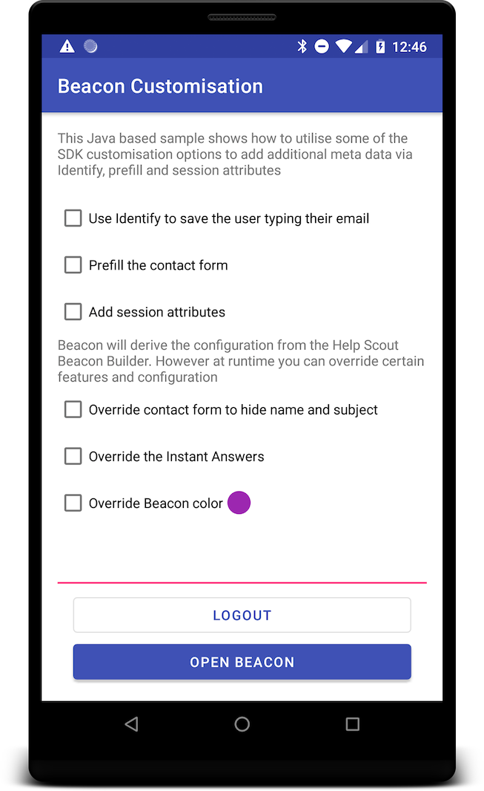

# Sample Customisation

This Java based sample illustrates some of the key features you can use to customise the Beacon SDK to add additional data about the
user and how to override certain Beacon settings.

For more information see the [Android technical documentation](https://developer.helpscout.com/beacon-2/android)

## Add additional meta data about your user using the Beacon

* [identify()](https://developer.helpscout.com/beacon-2/android/#normal-mode) - to provide email and name of the user
* Pre-populate the “Create a message” contact form data with Prefill
* Add session Attributes which are added to the Beacon visitor activity Note in the specific conversation the user creates

## Overriding Beacon config

* Edit contact form options
* Provide alternative Instant Answers
* Overide the Beacon color by providing an alternate hex color value
* Provide custom or text/string translations using Android String resources see [beacon-override.xml](./src/main/res/values/beacon-override.xml).
See the [translation strings](https://developer.helpscout.com/beacon-2/android/#translation-strings) in the documentation for a full list of the overridable strings.

